# 実機の使い方 - myCobot の場合

<!-- TOC -->

- [1. <a href="#start-mycobot-moveit-real-robot">myCobot280 の場合 </a>](#1-a-hrefstart-mycobot-moveit-real-robotmycobot280-%E3%81%AE%E5%A0%B4%E5%90%88-a)
    - [1.1. myCobot280 の固定](#11-mycobot280-%E3%81%AE%E5%9B%BA%E5%AE%9A)
    - [1.2. myCobot280 のファームウェア更新](#12-mycobot280-%E3%81%AE%E3%83%95%E3%82%A1%E3%83%BC%E3%83%A0%E3%82%A6%E3%82%A7%E3%82%A2%E6%9B%B4%E6%96%B0)
        - [1.2.1. myStudio のダウンロード](#121-mystudio-%E3%81%AE%E3%83%80%E3%82%A6%E3%83%B3%E3%83%AD%E3%83%BC%E3%83%89)
        - [1.2.2. USB ドライバのインストール](#122-usb-%E3%83%89%E3%83%A9%E3%82%A4%E3%83%90%E3%81%AE%E3%82%A4%E3%83%B3%E3%82%B9%E3%83%88%E3%83%BC%E3%83%AB)
        - [1.2.3. ファームウェアの更新](#123-%E3%83%95%E3%82%A1%E3%83%BC%E3%83%A0%E3%82%A6%E3%82%A7%E3%82%A2%E3%81%AE%E6%9B%B4%E6%96%B0)
    - [1.3. myCobot280 を Transponder モードにする](#13-mycobot280-%E3%82%92-transponder-%E3%83%A2%E3%83%BC%E3%83%89%E3%81%AB%E3%81%99%E3%82%8B)
    - [1.4. Ubuntu に myCobot を接続する](#14-ubuntu-%E3%81%AB-mycobot-%E3%82%92%E6%8E%A5%E7%B6%9A%E3%81%99%E3%82%8B)
    - [1.5. dialout グループへのユーザ追加](#15-dialout-%E3%82%B0%E3%83%AB%E3%83%BC%E3%83%97%E3%81%B8%E3%81%AE%E3%83%A6%E3%83%BC%E3%82%B6%E8%BF%BD%E5%8A%A0)
    - [1.6. pymycobot Python API のインストール](#16-pymycobot-python-api-%E3%81%AE%E3%82%A4%E3%83%B3%E3%82%B9%E3%83%88%E3%83%BC%E3%83%AB)

<!-- /TOC -->

実機と MoveIt! を使って
プログラムからロボットを操作する際の
実機の使い方を説明します．

<a id="start-mycobot-moveit-real-robot"></a>

## 1. <a href="#start-mycobot-moveit-real-robot">myCobot280 の場合 </a>

### 1.1. myCobot280 の固定

myCobot280がぐらつかないように，固定をしてください．

- 土台となる板を用意し，myCobot をネジで固定．

- 土台となる板自体がぐらつかないように，机と固定．または，大きな板を使用してください．

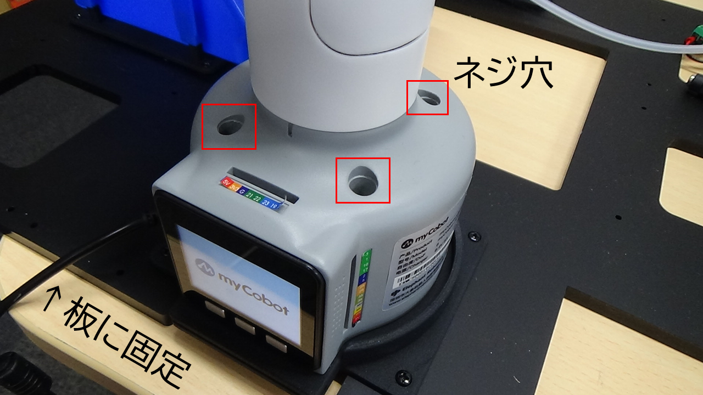

- [Flat Stand](https://docs.elephantrobotics.com/docs/gitbook-en/2-serialproduct/2.7-accessories/2.7.1-fsta.html)や[Gベース](https://docs.elephantrobotics.com/docs/gitbook-en/2-serialproduct/2.7-accessories/2.7.1-fsta.html)のような固定用ベース部品を利用することもできます．

### 1.2. myCobot280 のファームウェア更新

#### 1.2.1. myStudio のダウンロード

Windows PCが必要です．

[MyStudio の リリースページ](https://github.com/elephantrobotics/MyStudio/releases)
にアクセスし，
最新の exe ファイルをダウンロード・実行してください．

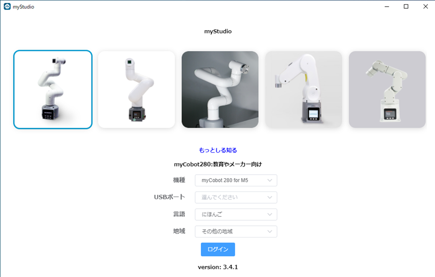

#### 1.2.2. USB ドライバのインストール

Windows/VMware上のUbuntuからmyCobotを制御する場合、Windows側のドライバーをインストールしない場合VMwareからうまく認識されない場合がありますので、以下のUSBドライバをインストールしておいた方が良いでしょう。

[SILICON LABS CP210x USB - UART ブリッジ VCP ドライバ](https://jp.silabs.com/developers/usb-to-uart-bridge-vcp-drivers?tab=downloads)
にアクセスし，
**CP210x Windows Drivers** をダウンロードしてください。
ZIPファイルを展開して、**CP210xVCPInstaller_x64.exe** を実行します。

#### 1.2.3. ファームウェアの更新

アーム先端の M5Stack Atom と胴体の M5Stack Basic のファームウェアを更新します．

**M5Stack Atom のファームウェア更新**

今回は，AtomMain の v4.1 をインストールします．

MyStudio を立ち上げた後，
アーム先端の Atom とパソコンを接続してください．

MyStudio の画面で USB Port の欄が ATOM になったはずです．

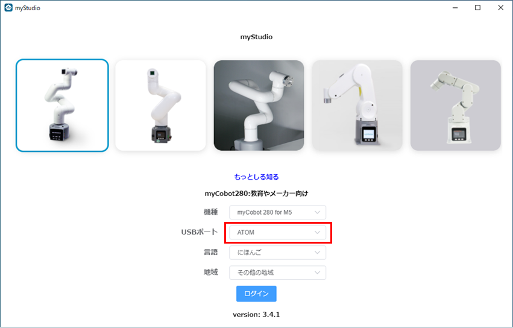

その状態で接続した後，Basic タブをクリックし，AtomMain の v4.1 を選択してインストールします．

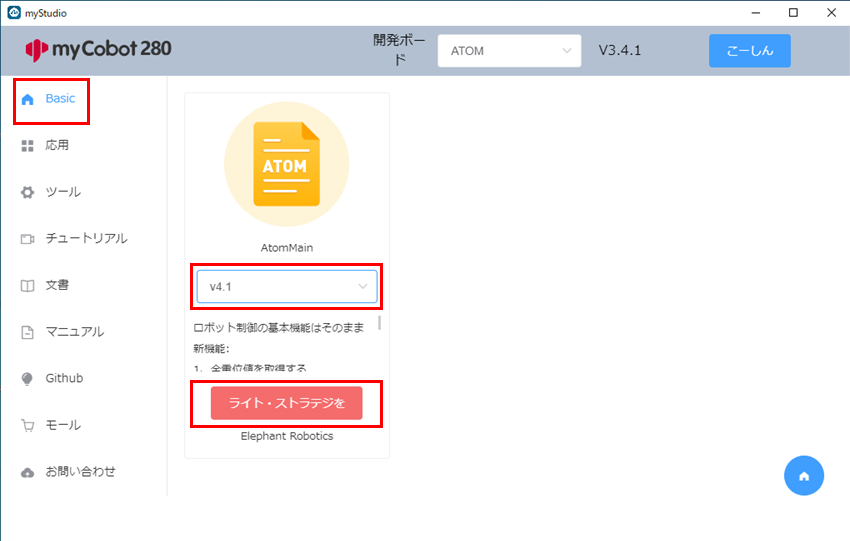

**M5Stack Basic のファームウェア更新**

今回は，minirobot の v1.0 をインストールします．

MyStudio を立ち上げた後，
胴体の Basic とパソコンを接続してください．

MyStudio の画面で USB Port の欄が BASIC になったはずです．

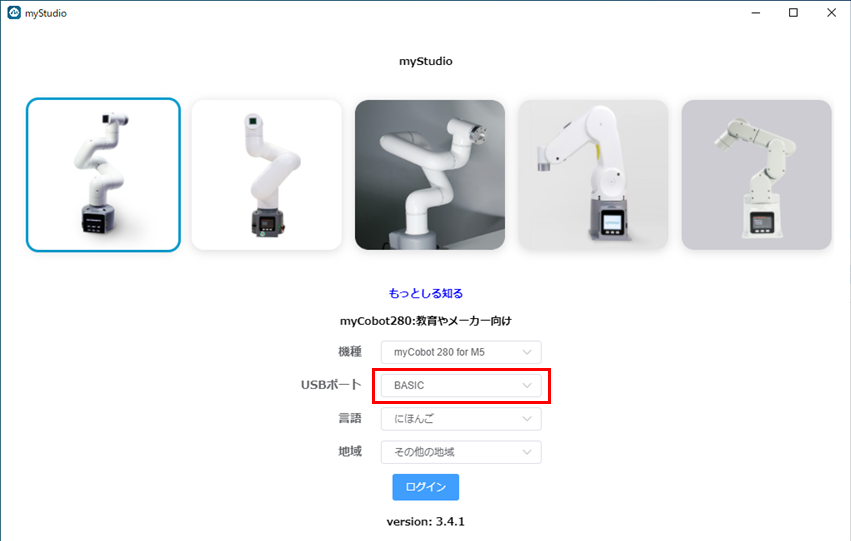

その状態で接続した後，Basic タブをクリックし，minirobot の v1.0 を選択してインストールします．

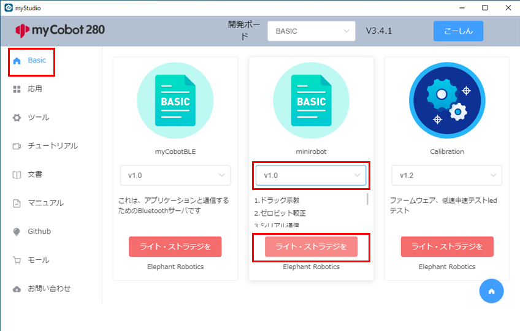

**動作確認（ティーチングデモ）**

Basic とパソコンを接続し，
myCobot の画面 (miniroboFlow) から Maincontrol を選択してください．

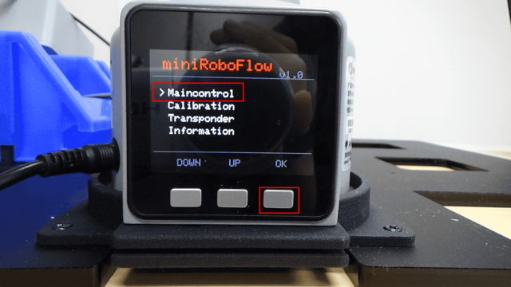

動作のティーチングを行うために，Record を選択してください．

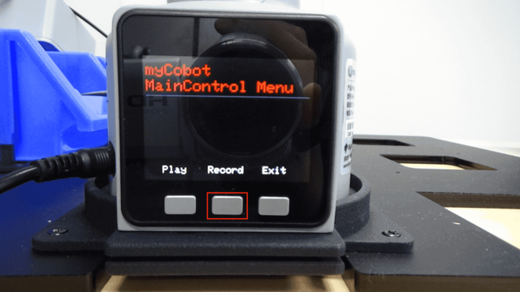

Recording to Ram/Flash? と聞かれるので，Ram を選択してください．

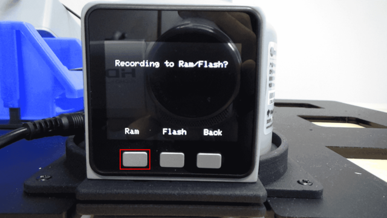

同様に，Play で教えた動作を再生します．

### 1.3. myCobot280 を Transponder モードにする

以降，パソコンから myCobot に指令を送る際には，
myCobot の画面 (miniroboFlow) から Transponder を選択してください．

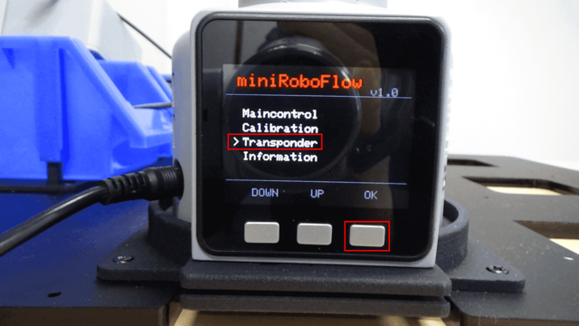

### 1.5. Ubuntu に myCobot を接続する

VMware上でUbuntu/ROSを動作させている場合、myCobot を Ubuntuに 繋ぎかえる必要があります。
以下の図のように、左側のメニューから **[取り外し可能デバイス(R)]→[Sillicon CP2104 USB to UART Bridge Controller]→[接続(ホストから切断)]** を選びます。

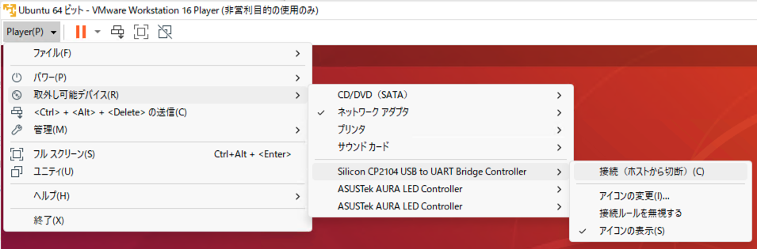

Ubuntu側のターミナルで **dmesg** コマンドを打つと、以下のように接続した myCobot がどのデバイスに割り当てられたのかが確認できます。以下の例では ttyUSB0 というデバイス名であることがわかります。

```bash
tork@tork:~$ dmesg
 : 略
[11395.512212] cp210x ttyUSBO: cp210x converter now disconnected from ttyUSBO
[11395.512477] c210x 2-2.1:1.0: device disconnected
[11627.130359] usb 2-2.1: new full-speed USB device number 8 using uhci_hed
[11627.385716] usb 2-2.1: New USB device found, idVendor=10c4, idProduct=ea60, bedDevice= 1.00
[11627.385718] usb 2-2.1: New USB device strings: Mfr=1, Product=2, SerialNumber=3
[11627.385718] usb 2-2.1: Product: CP2104 USB to UART Bridge Controller
[11627.385719] usb 2-2.1: Manufacturer: Silicon Labs
[11627.3857201 usb 2-2.1: SerialNumber: 0243F1AF
[11627.390106] c210x 2-2.1:1.0: cp210x converter detected
[11627.396964] usb 2-2.1: cp210 converter now attached to ttyUSBO
tork@tork:~$
```

myCobotのデバイス名は ttyUSB? と ttyACM? のような2種類あります。 デバイスファイルの場所は以下のようになります。

- /dev/ttyUSB0
- /dev/ttyACM0

デバイス名の最後の0は、これらのデバイスが複数接続された場合は 0, 1, 2, ... のように自動で割り当てられます。

### 1.4. dialout グループへのユーザ追加

シリアルポートにアクセス権を持つ，
dialoutグループにユーザを追加します．
NEDO ROSイメージの場合は、すでにこの設定が行われている場合があります。

**ターミナル**

```bash
sudo adduser $USER dialout 
```

### 1.5. pymycobot (Python API) のインストール

myCobot を Python で動かすための API をインストールします．

**ターミナル**

```bash
pip install pymycobot --user
```

**動作確認**

```python
In [1]: from pymycobot.mycobot import MyCobot
In [2]: mycobot=MyCobot('/dev/ttyUSB0')
```

ここで、myCobot が ttyACM デバイスに割り当てられている場合は、

```python
In [1]: from pymycobot.mycobot import MyCobot
In [2]: mycobot=MyCobot('/dev/ttyACM0')
```

のようにします。
では、myCobotの手先のLEDの色を変更してみます。

```python
In [3]: mycobot.set_color(0,0,255)
```

LEDは以下のように青色になったと思います。

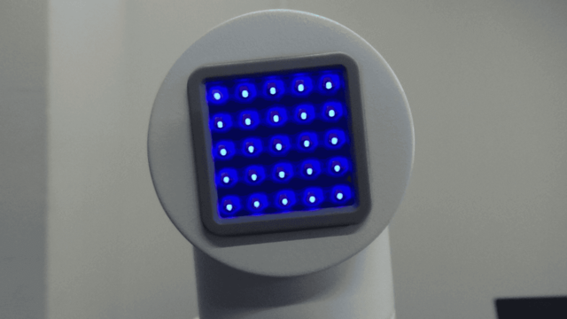


次は、以下のように少し変えてみます。

```python
In [4]: mycobot.set_color(0,255,255)
```

LEDが以下のように青緑色になったと思います。

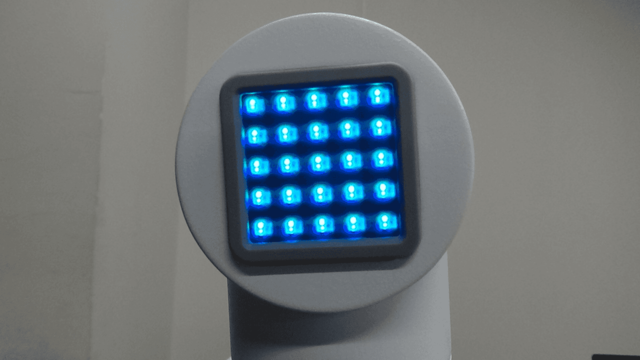

次に、アームを初期姿勢にしてみます。全ての関節角度に0[rad]を渡してみます。

```python
In [5]: from pymycobot.genre import Angle
In [6]: mycobot.send_angles([0,0,0,0,0,0], 80)
```

以下のように、アームが直立した初期姿勢になったと思います。

![myCobot - pymycobot API: mycobot.send_angles([0,0,0,0,0,0], 80)](figs/mycobot-pymycobot-api-send-angles-to-reset-pose.png)

以上が問題なく動作すれば、Ubuntu と myCobot が問題なく接続され、pymycobot モジュールも正常にインストールされていることになります。

<div style="text-align: center;">
    <a href="../rosset_simulator"><strong>◀[前]「NEDO ROSセットのシミュレータの利用」</strong></a>
    ・
    <a href="../program_basic"><strong>「MoveIt!プログラミングの基礎」[次]▶</strong></a>
</div>

<!-- EOF -->
