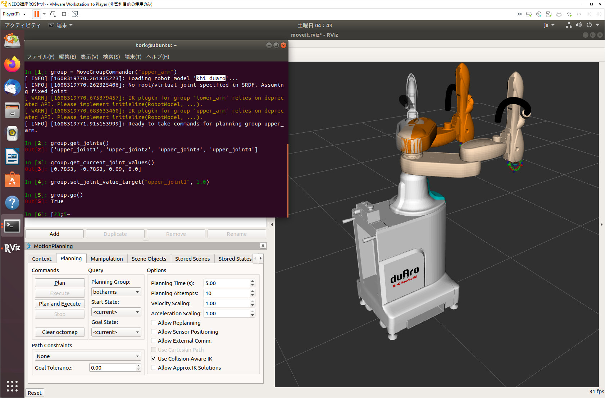
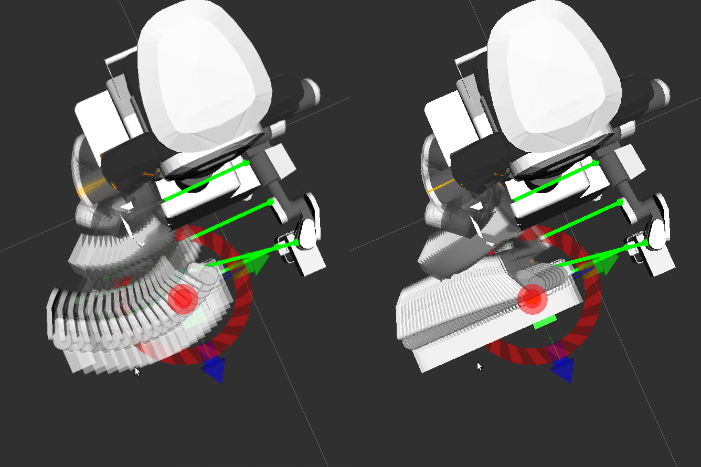

# MoveIt!プログラミングの基礎

<!-- TOC -->

- [MoveIt!プログラミングの基礎](#moveitプログラミングの基礎)
    - [プログラムを入力して実行する](#プログラムを入力して実行する)
        - [特定の関節を動かす](#特定の関節を動かす)
        - [腕全体の関節を動かす](#腕全体の関節を動かす)
        - [手先の位置を指定して動かす](#手先の位置を指定して動かす)
        - [手先の姿勢を指定して動かす](#手先の姿勢を指定して動かす)
        - [手先の位置と姿勢を指定して動かす](#手先の位置と姿勢を指定して動かす)
        - [直線補間軌道でロボットを動かす](#直線補間軌道でロボットを動かす)
        - [連続した指令をロボットに送る](#連続した指令をロボットに送る)
        - [四角形や円に沿ってエンドエフェクタを動かす](#四角形や円に沿ってエンドエフェクタを動かす)
    - [プログラムファイルを実行する](#プログラムファイルを実行する)
        - [KHI duaro の場合](#khi-duaro-の場合)
        - [ROS や MoveIt! のメリット](#ros-や-moveit-のメリット)

<!-- /TOC -->

物理シミュレータと MoveIt! を使って
プログラムからロボットを操作します．

## プログラムを入力して実行する

1行もしくは数行ごとにプログラムを入力して実行し，
各コマンドで何をしているのかを見てみます．

シミュレータや MoveIt! を起動し，
それらを起動したターミナルとは別に新たにターミナルを起動して
ROS の環境設定と対話的にプログラミングを行えるように準備します．

まず，[NEDO ROSセットのシミュレータの利用](../rosset_simulator) で
行ったのと同じように，gazebo と MoveIt! を起動します．

次に1行もしくは複数行ごとにプログラミングとその実行を行う
対話的プログラミングコンソールを起動します．

**ターミナル** : 対話的プログラミングのコンソールの起動
```
$ rosrun tork_moveit_tutorial demo.py
```

### 特定の関節を動かす

プログラムから関節を動かすなどをするために「右腕」の `group` を作成します．
次の `In[1]:` 以下につづくプログラムを入力して [Enter/Return] キーを押して
1行ずつ実行してください．

- 補足 : `In [1]:` の `[ ]` の中の数字はプログラム入力するたびに更新されます．本チュートリアルにある入力例にある数字と一致しない場合がありますがそれは問題ありませんので，そのままチュートリアルを進めてください．


```python
In [1]: group = MoveGroupCommander("upper_arm")
[ INFO] [1511506815.441893962, 135.795000000]: TrajectoryExecution will use new action capability.
[ INFO] [1511506815.442105792, 135.795000000]: Ready to take MoveGroup commands for group right_arm.

In [2]:
```

- 注意：以下のように`TrajectoryExecution will use old action capability.`と表示される場合も有りますが問題ありません．

```python
In [1]: group = MoveGroupCommander("upper_arm")
[ INFO] [1511506815.441893962, 135.795000000]: TrajectoryExecution will use old action capability.
[ INFO] [1511506815.442105792, 135.795000000]: Ready to take MoveGroup commands for group right_arm.
```

グループ `group` に含まれる関節の名前を `get_joints()` で調べます．

```python
In [2]: group.get_joints()
Out[2]: ['upper_joint1', 'upper_joint2', 'upper_joint3', 'upper_joint4']

In [3]:
```

上は duAro の右腕（根本軸が上側の腕）の場合の出力結果で
`upper_joint1`〜`upper_joint4` の4つの関節があることがわかります．

なお、上記コマンドプロンプトで **group.** を入力した時点で TAB キーを押すと、候補となる関数一覧が表示されます。
どのような関数があるか見てみましょう。
また、カーソルの上下キーを押すと、過去に入力したコマンド履歴を参照して入力することもできます、

根元の間接である `upper_joint1` を動かしてみます．

`set_joint_value_target()` を使って関節の目標値を設定します．
`set_joint_value_target()` に関節名 `'upper_joint1'` と
関節角度を `1.0`（単位ラジアン[rad]）を渡します．

```python
In [3]: group.get_current_joint_values()
Out[3]: [0.7853, -0.7853, 0.09, 0.0]
In [4]: group.set_joint_value_target( 'upper_joint1', 1.0 )

```

関節角度目標を設定したので `go()` で動かします．

```python
In [5]: group.go()
Out[5]: True
```

正常に動作が完了すると `True` が返ってきます．
根本関節 `upper_joint1` が少し屈曲したと思います．


同じ要領で他の右腕の関節もそれぞれ動かしてみます．

<div align="center">

</div>
<div style="text-align: center;">duAro - 関節制御</div>

]
```python
In [5]: group.set_joint_value_target( 'upper_joint2', -1.0 )
In [6]: group.go()
Out[6]: True

In [7]: group.set_joint_value_target( 'upper_joint3', 1.00 )
In [8]: group.go()
Out[8]: True

In [9]: group.set_joint_value_target( 'Rupper_joint4', 0.5 )
In [10]: group.go()
Out[10]: True
```


### 腕全体の関節を動かす

`set_joint_value_target()` は1つの関節だけでなく
腕全体の関節角度目標値のリストを渡すことで複数の関節を同時に動かすこともできます．
`group.get_joints()` で調べたように duAro の右腕には4つの関節があるので
4つ分の関節角度目標値 [rad] を持ったリストを `set_joint_value_target()` に渡します．

```python
In [11]: joints = group.get_current_joint_values()
In [12]: joints[0] = 1.2
In [11]: group.set_joint_value_target(joints)
In [12]: group.go()
Out[12]: True
```

duAro の腕の姿勢が変化していることが確認できます．

### 手先の位置を指定して動かす

手先（エンドエフェクタリンク）の位置を指定して腕を動かしてみます．

`set_position_target()` を使います．
手先の目標位置の座標 ( x, y, z ) をリスト `[ X, Y, Z ]` で
`set_position_target()` に渡します．

位置座標の単位はメートル [m] です．
各軸の方向は下記の右手座標系です．

- X方向 : 正 = 前 / 負 = 後
- Y方向 : 正 = 左 / 負 = 右
- Z方向 : 正 = 上 / 負 = 下


```python
In [19]: group.get_current_pose()
Out[19]:
header:
  seq: 0
    stamp:
      secs: 1608324683
      nsecs: 387974387
    frame_id: "world"
pose:
  position:
    x: -0.153114880603
    y: 0.622901999087
    z: 0.993383808556
  orientation:
    x: 0.0
    y: 0.0
    z: 0.0616824949101
    w: 0.998095821964

In [20]: pos = [-0.2, 0.5, 1.0]
In [21]: group.set_position_target(pos)
```

`go()` を使って実行します．

```python
In [22]: group.go()
Out[22]: True
```

手先の「位置」しか指定していないので
手先の「姿勢」は思わぬ方を向いていることもあります．


### 手先の姿勢を指定して動かす

手先の姿勢を指定してロボットを動かしてみます．

`set_rpy_target()` を使います．
手先の目標姿勢の角度 ( roll, pitch, yaw ) をリスト `[ R, P, Y ]` で
`set_rpy_target()` に渡します．
ちなみに，duAroはスカラロボットなので，手先の姿勢のうち R, P は常に0.0です．
0.0以外の値を与えると plan ができずにエラーとなります． 

```python
In [30]: rpy = [0.0, 0.0, -0.1]
In [31]: group.set_rpy_target(rpy)
```

`go()` を使って実行します．

```python
In [32]: group.go()
Out[32]: True
```

手先の「姿勢」しか指定していないので
手先の「位置」は思わぬところにあることもあります．

- 注意：以下のようなエラーメッセージが表示された場合は，再度 `group.go()` をお送りください．
```
[ INFO] [1515668193.145149146, 166.319999999]: ABORTED: Solution found but controller failed during execution
```

### 手先の位置と姿勢を指定して動かす

手先の位置と姿勢を同時に指定して腕を動かすことができます．

`set_pose_target()` を使います．
次のいずれか1つを `set_pose_target()` に渡して手先の位置と姿勢を指定します．

- 位置座標と Roll/Pitch/Yaw 姿勢角の6つの数値のリスト `[x, y, z, rot_x, rot_y, rot_z]`
- 位置座標とクォータニオンの7つの数値のリスト `[x, y, z, qx, qy, qz, qw]`
- `Pose`型
- `PoseStamped`型

どれを渡しても `set_pose_target()` 内で判断して適切な処理がなされます．

- 参考 : GitHub - move_group.py 内の `set_pose_target()` の定義

[https://github.com/ros-planning/moveit/blob/1.0.2/moveit_commander/src/moveit_commander/move_group.py#L252][6cf69e4b]

  [6cf69e4b]: https://github.com/ros-planning/moveit/blob/1.0.2/moveit_commander/src/moveit_commander/move_group.py#L252 "set_pose_target()"

それでは右手先の位置と姿勢を指定して腕を動かしてみます．
まずは 位置とRPY角 を `set_pose_target()` に渡して動作させます．
```python
In [41]: posrpy = [-0.3, 0.2, 1.0, 0.0, 0.0, -0.1]
In [41]: group.set_pose_target(posrpy)
In [42]: group.go()
Out[42]: True
```

もう1つ位置・姿勢を指定して腕を動かしてみます．

```python
In [43]: posrpy = [-0.1, 0.5, 1.1, 0.0, 0.0, -0.12]
In [44]: group.set_pose_target(posrpy)
In [45]: group.go()
Out[45]: True
```

今度は 位置とクォータニオン を `set_pose_target()` に渡して腕を動かしてみます．

```python
In [46]: xyzw = [-0.3, 0.2, 1.0, 0.0, 0.0, -0.04, 0.99]
In [47]: group.set_pose_target(xyzw)
In [48]: group.go()
Out[49]: True
```

```python
In [50]: xyzw = [-0.1, 0.5, 1.1, 0.0, 0.0, -0.06, 0.99]
In [51]: group.set_pose_target(xyzw)
In [52]: group.go()
Out[52]: True
```
-->

次に `Pose` 型を `set_pose_target()` に渡して腕を動かしてみます．
Pose型では，手先の姿勢はクォータニオンで与えます．

> - クォータニオン（四元数/しげんすう）
>     - 空間上の姿勢を表現するための4つの成分をもつベクトル
>         - 複素数から拡張された数体系
>     - 回転の結合・補間の計算が容易
>     - Roll/Pitch/Yaw のオイラー角により姿勢を表現した場合と比べて
>         - 長所
>             - ジンバルロックという特異点がない
>             - 計算が速い
>         - 短所
>             - 直感的に分かりにくい
>     - 比較的理解しやすい Roll/Pitch/Yaw からクォータニオンに変換することも可能
>         - 3D Rotation Converter
>             - https://www.andre-gaschler.com/rotationconverter/
>         - ROS Wiki - Quaternion Basics
>             - http://wiki.ros.org/tf2/Tutorials/Quaternions
>     - ロボット以外では航空宇宙や 3D グラフィックスなどの分野で用いられる


```python
In [49]: p1 = Pose()

In [50]: print( p1 )
position:
  x: 0.0
  y: 0.0
  z: 0.0
orientation:
  x: 0.0
  y: 0.0
  z: 0.0
  w: 0.0

In [51]: p1.position.x = -0.1
In [52]: p1.position.y = 0.5
In [53]: p1.position.z = 1.1
In [54]: p1.orientation.x = 0.0
In [55]: p1.orientation.y = 0.0
In [56]: p1.orientation.z = -0.06
In [57]: p1.orientation.w = 1.0

In [58]: print( p1 )
position:
  x: 0.4
  y: -0.4
  z: 0.15
orientation:
  x: 0.0
  y: -0.707
  z: 0.0
  w: 0.707

In [59]: group.set_pose_target( p1 )
In [60]: group.go()
Out[60]: True
```

ポーズをもう1つ指定して腕を動かします．

```python
In [61]: p2 = Pose()

In [62]: print( p2 )
position:
  x: 0.0
  y: 0.0
  z: 0.0
orientation:
  x: 0.0
  y: 0.0
  z: 0.0
  w: 0.0

In [63]: p2.position.x = -0.3
In [64]: p2.position.y = 0.2
In [65]: p2.position.z = 1.0
In [66]: p2.orientation.z = -0.05
In [67]: p2.orientation.w = 1.0


In [68]: print( p2 )
position:
  x: -0.3
  y: 0.2
  z: 1.0
orientation:
  x: 0.0
  y: 0.0
  z: -0.05
  w: 1.0

In [69]: group.set_pose_target( p2 )
In [70]: group.go()
Out[70]: True
```

### 直線補間軌道でロボットを動かす

`group.plan()` や `group.go()` を用いた動作計画では動作開始姿勢と目標姿勢の間の動作は
各関節の開始角度と目標角度の間を補間した動作として計画されます．
このことは開始姿勢や目標姿勢として指定した姿勢以外の動作途中におけるエンドエフェクタの姿勢は保証されないことを意味します．

エンドエフェクタを目標姿勢間で直線的に動作させたい場合は
`group.compute_cartesian_path()` を用いて動作計画をします．
`compute_cartesian_path()` はその名前のとおり，
直行座標（=デカルト座標: Cartesian Coordinates）における補間軌道（Path）を作成します．

`group.plan()` や `group.go()` で作成された動作計画（画像:左）と
`group.compute_cartesian_path()` で作成された動作計画（画像:右）を比較すると
次のようになります．


<div align="center">

</div>
<div style="text-align: center;">MoveIt! - 軌道の比較plan()/go() (左)/compute_cartesian_path() (右)</div>

`compute_cartesian_path()` の具体的な使用方法は本項に続く項目の

- 連続した指令をロボットに送る
- 四角形や円に沿ってエンドエフェクタを動かす

を通して学習します．


### 連続した指令をロボットに送る

ロボットの複数の異なる姿勢を指示して動作計画と実行を行います．

複数の姿勢を指定した動作計画を行う場合も直線補間軌道でロボットを動かす場合と同じ 
`compute_cartesian_path()` を用います．

`compute_cartesian_path( self, waypoints, eef_step, jump_threshold, avoid_collisions = True )` 
には次のものを渡します．

- `waypoints` : エンドエフェクタが経由する姿勢のリスト
- `eef_step` : エンドエフェクタの姿勢を計算する間隔の距離
- `jump_threshold` : 軌道内の連続する点間の最大距離（`0.0` で無効）
- `avoid_collisions` : 干渉と運動学上の制約チェック（デフォルトは `True` でチェックする）

本チュートリアル手順に則って進めている場合，
複数の姿勢のリスト `waypoints` が用意されているので内容を確かめてみます．

```python
In [81]: print( waypoints )
[position:
  x: 0.4
  y: -0.4
  z: 0.15
orientation:
  x: 0.0
  y: -0.707
  z: 0.0
  w: 0.707, position:
  x: 0.4
  y: -0.2
  z: 0.15
orientation:
  x: 0.0
  y: -0.707
  z: 0.0
  w: 0.707, position:
  x: 0.3
  y: -0.3
  z: 0.5
orientation:
  x: 0.0
  y: -1.0
  z: 0.0
  w: 0.0, position:
  x: 0.3
  y: -0.5
  z: 0.5
orientation:
  x: 0.0
  y: -1.0
  z: 0.0
  w: 0.0]

In [82]:

```

姿勢のリスト `waypoints` を `compute_cartesian_path()` に渡して動作計画を作成します．

```python
In [82]: ( plan, fraction ) = group.compute_cartesian_path( waypoints, 0.01, 0.0 )
```

`compute_cartesian_path()` で得られた計画 `plan` を
`group.execute()` に渡してロボットで動作を実行します．

```python
In [83]: group.execute( plan )
Out[83]: True
```

### 四角形や円に沿ってエンドエフェクタを動かす

エンドエフェクタを四角形や円に沿って動かすような場合も
複数の異なる姿勢を指示して動作計画と実行を行います．

四角形や円に沿った複数の姿勢のリストをそれぞれ
`waypoints_rectangular` と `waypoints_circular` として
用意しているのでそれらを使います．

```python
In [91]: print( waypoints_rectangular )
[position:
  x: 0.25
  y: 0.0
  z: 0.1
orientation:
  x: 0.0
  y: -0.707106781187
  z: 0.0
  w: 0.707106781187, position:
  x: 0.25
  y: -0.2
  z: 0.1
orientation:
  x: 0.0
  y: -0.707106781187
  z: 0.0
  w: 0.707106781187, position:
  x: 0.45
  y: -0.2
  z: 0.1
orientation:
  x: 0.0
  y: -0.707106781187
  z: 0.0
  w: 0.707106781187, position:
  x: 0.45
  y: 0.0
  z: 0.1
orientation:
  x: 0.0
  y: -0.707106781187
  z: 0.0
  w: 0.707106781187, position:
  x: 0.25
  y: 0.0
  z: 0.1
orientation:
  x: 0.0
  y: -0.707106781187
  z: 0.0
  w: 0.707106781187]

In [92]: ( plan, fraction ) = group.compute_cartesian_path( waypoints_rectangular, 0.01, 0.0 )

In [93]: group.execute( plan )
Out[93]: True
```

同様に円に沿った動作を行います．

```python
In [94]: ( plan, fraction ) = group.compute_cartesian_path( waypoints_circular, 0.01, 0.0 )

In [95]: group.execute( plan )
Out[95]: True
```

`exit` もしくは `quit` で終了します．

```python
In [96]: exit
```

## プログラムファイルを実行する

コンソールでのプログラム実行は学習や各コマンドの動作確認には良いのですが，
毎回同じことを入力して実行するのは大変なので命令が書かれたプログラムファイルを実行します．

プログラムファイルを実行する前に物理シミュレータと MoveIt! を起動しておきます．

### KHI duaro の場合

MoveIt!を起動していなければ，以下のコマンドで再度起動します．
**ターミナル-1**
```
$ roslaunch khi_duaro_moveit_config demo.launch
```
<!-- $ roslaunch khi_duaro_moveit_config moveit_planning_execution.launch -->

動作プログラムファイルを実行します．
ここでは，作成するスクリプトを自作のパッケージ **my_tutorial** として
作成しそこに配置する例を示します．

まず，catkin create pkg で作成します．

**ターミナル-2**
```
$ mkdir -p ~/catkin_ws
$ cd catkin_ws/src
$ catkin create pkg my_tutorial
```

続いて，my_tutorialディレクトリに入り，スクリプトを作成します．
作成したスクリプトには chmod 755 で実行権限を付与しておきます．

**ターミナル-2 (続き)**
```
$ cd my_tutorial
$ mkdir script
$ cd script
$ cat > duaro_moveit_tutorial_poses.py
ここで，下の duaro_moveit_tutorial_poses.py をコピペ，Ctrl+Dで抜ける
$ chmod 755 duaro_moveit_tutorial_poses.py
```

最後に catkin build でワークスペースをビルドし，ワークスペースの
設定 setup.bash を source で読み込んだ上で，rosrunで my_tutorial
パッケージのスクリプトを起動します．

**ターミナル-2 (続き)**
```
$ catkin build
$ source ~/catkin_ws/devel/setup.bash
$ rosrun my_tutorial duaro_moveit_tutorial_poses.py
または
$ rosrun tork_moveit_tutorial duaro_moveit_tutorial_poses.py
(同じスクリプトは以下のパッケージ内にすでにいストール済み)
```

**duaro_moveit_tutorial_poses.py**

```python
#!/usr/bin/env python

from tork_moveit_tutorial import *


if __name__ == '__main__':

    init_node()

    group = MoveGroupCommander("upper_arm")

    # Pose Target 1
    rospy.loginfo( "Start Pose Target 1")
    pose_target_1 = Pose()

    pose_target_1.position.x =  0.0
    pose_target_1.position.y =  0.55
    pose_target_1.position.z =  1.0
    pose_target_1.orientation.x =  0.0
    pose_target_1.orientation.y =  0.0
    pose_target_1.orientation.z =  0.0
    pose_target_1.orientation.w =  0.0

    rospy.loginfo( "Set Target to Pose:\n{}".format( pose_target_1 ) )
    group.set_pose_target( pose_target_1 )
    group.go()

    # Pose Target 2
    rospy.loginfo( "Start Pose Target 2")
    pose_target_2 = Pose()

    pose_target_2.position.x = -0.55
    pose_target_2.position.y = -0.0
    pose_target_2.position.z =  1.05
    pose_target_2.orientation.x =  0.0
    pose_target_2.orientation.y =  0.0
    pose_target_2.orientation.z =  0.707
    pose_target_2.orientation.w =  0.707

    rospy.loginfo( "Set Target to Pose:\n{}".format( pose_target_2 ) )
    group.set_pose_target( pose_target_2 )
    group.go()

```

このプログラムを書き換えて，いろいろ試してみましょう．

他のロボットの動作計画・動作の実行ファイルとの相違点は次のとおりです．

- `group = MoveGroupCommander()` に渡すグループ名を `"upper_arm"` に変更
- ターゲットポーズの位置・姿勢を KHI duaro の機構に適したものに変更

### ROS や MoveIt! のメリット

KHI duAro を例にとり，ロボット制御をプログラムから行う方法に
ついて見てきましたが，動作計画・動作プログラムにおいて，
ほかのロボットとの相違点はほとんどありません．
ロボットが代わった場合に変更すべき部分は，下記の2ヶ所程度であり，
ロボットが変わっても，プログラム方法はほとんど変わらないので，
様々なメーカーのロボットをこれらの知識で制御することができます．

- group = MoveGroupCommander() に渡すグループ名を各ロボットアームに対応したものにする
- ターゲットポーズの位置・姿勢を各ロボットの機構に適したものにする

このように「**ロボットが異なっても基本的には同じプログラムが動く**」ということが
ROS や MoveIt! のインタフェースを使用する最大のメリットの1つであるといえます．


<div style="text-align: center;">
    <a href="../rosset_simulator"><strong>◀[前]「NEDO ROSセットのシミュレータの利用」</strong></a>
    ・
    <a href="../"><strong>「トップに戻る」[次]▶</strong></a>
</div>
<!-- EOF -->
