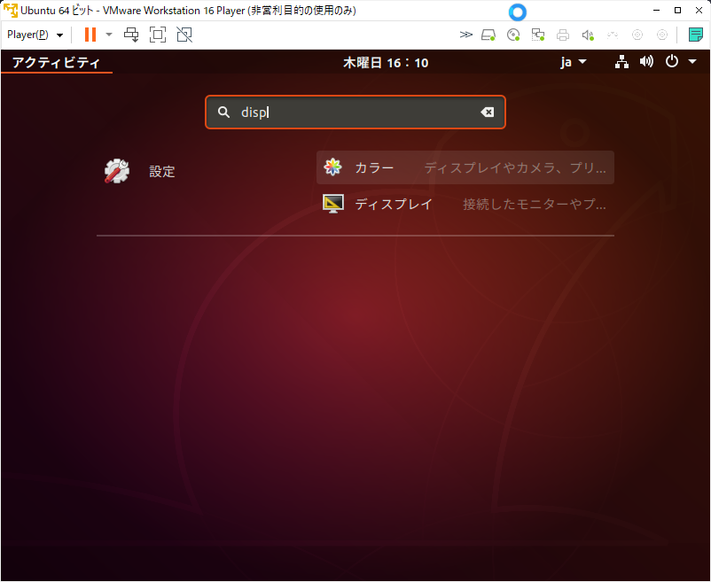
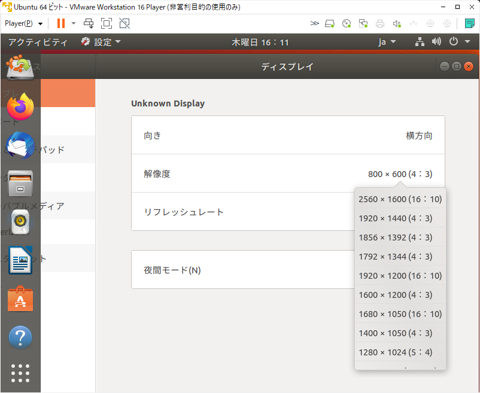
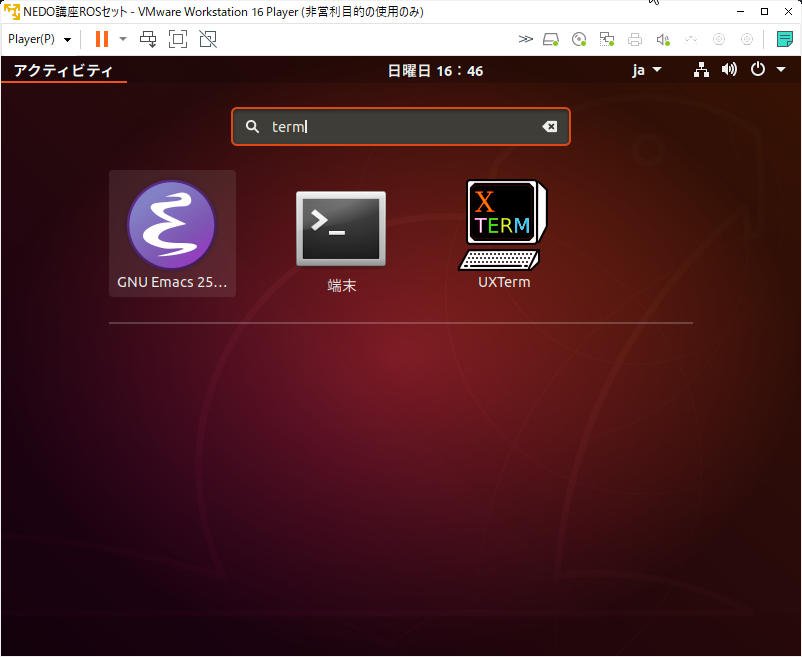
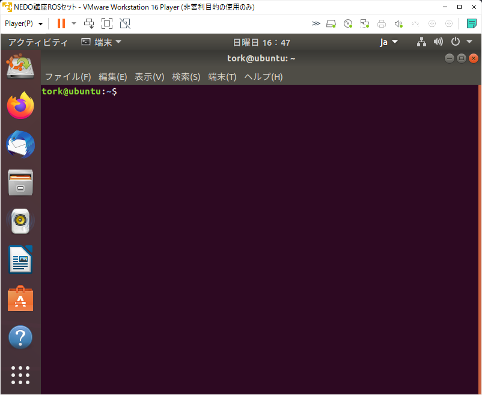
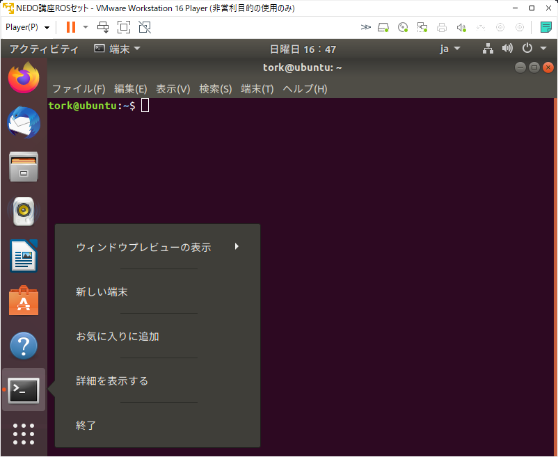
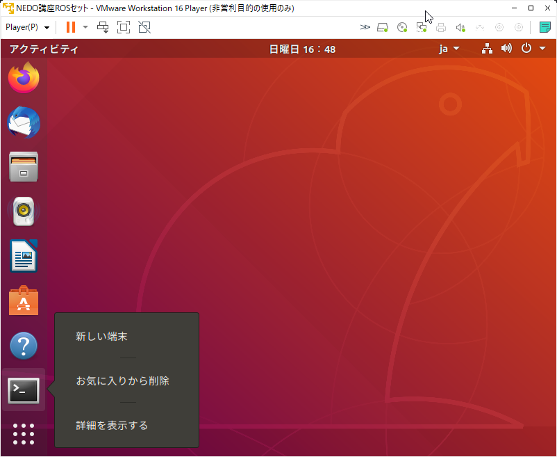

# NEDO ROSセット基本設定

<!-- TOC -->

- [NEDO ROSセット基本設定](#nedo-rosセット基本設定)
    - [解像度の設定](#解像度の設定)
    - [端末 (Terminal) のブックマーク](#端末-terminal-のブックマーク)
    - [ROS環境設定](#ros環境設定)

<!-- /TOC -->

NEDO ROSセットを起動した際に、使いやすくするための基本的な設定を行います。

## 解像度の設定

VMwareなどの仮想マシンでROSセットを起動した際等では、
起動時の画面の解像度が低く、画面が狭いことがあります。

あらかじめ、画面を可能な限り広く設定して甥が萌芽良いでしょう。

まず初めに、左下の●が9個のボタンをクリックし、
検索ウインドウを開きます。上部の検索窓に **disp** と
入力すると、左に **設定** 右に **ディスプレイ** と
表示されますので、そのアイコンをクリックします。

<div align="center">

</div>

ディスプレイの設定画面が開いたら、適切な解像度を選択します。

<div align="center">

</div>

新しい解像度を設定したら、**「このディスプレイ設定を保存しますか」** と
表示されますので、**はい** を押して設定を確定させます。

<div align="center">

</div>

以降、広い画面で操作することができます。

## 端末 (Terminal) のブックマーク

ROS/MoveIt! を利用する際衣には、端末 (gnome-terminal : コマンド入力端末) 
を頻繁に起動しますので、左のランチャーに端末起動ショートカットボタンを
登録しておいた方が便利でしょう。

まず、上記と同様に左下の●が9個のボタンをクリックし、
検索ウインドウを開きます。上部の検索窓に **term** と入力すると、
以下のように、候補となるアプリケーションが表示されます。
**端末** アイコンをクリックし、ターミナルを起動します。


<div align="center">

</div>

端末起動画面は以下の通りです。

<div align="center">

</div>

左側の端末のアイコンを右クリックし、コンテキストメニューを
表示させます。

<div align="center">

</div>

**お気に入りに追加** というメニューがありますので、
クリックすると、以下のように、左側のランチャーに追加されます。

<div align="center">

</div>

## ROS環境設定

ROSでは、ROS使用時に必要な環境設定が /opt/ros/melodic/setup.bash という
ファイルに用意されていますので、これを読み込み，ROS の環境を設定します．

```
$ source /opt/ros/melodic/setup.bash
```

これは新しくターミナルを立ち上げて ROS を使用する前に毎回必要になります．
下記のように .bashrc ファイルに設定を加えて
ターミナル起動時に setup.bash を自動で実行し ROS 環境になるようにしておくと便利です．

```
$ echo "source /opt/ros/melodic/setup.bash" >> ~/.bashrc
```

- **注意**: 上記コマンドの `>>` を `>` にしてしまうと元々あった .bashrc 内の設定が消えてしまうので気をつけてください．

.bashrc の設定ができていると以後のターミナルを起動するたびに行う
`source /opt/ros/melodic/setup.bash` は不要です．

ここで、今コマンドを入力した端末で以下のコマンドを入力します。
環境変数にROSという文字列を含むもののみを表示させてみます。

```
$ env | grep ROS
$
```
何も表示されません。今度は、新たに端末を立ち上げて、
再度同じコマンドを入力して見ます。すると、
今度はROS_で始まる環境変数が多数見つかるはずです。

```
$ env | grep ROS
ROS_ETC_DIR=/opt/ros/melodic/etc/ros
ROS_ROOT=/opt/ros/melodic/share/ros
 : 中略
ROS_DISTRO=melodic
$
```

もし、新しく起動した端末で、ROS関係の環境変数が見つからない場合は、
上記の設定、手順が間違っている可能性がありますので、
まずは ~/.bashrc の最後の部分を確認して、再度設定を行ってください。


次は、シミュレータを実際に起動してみます。


[**次「NEDO ROSセットのシミュレータの利用」**](../rosset_simulator)

