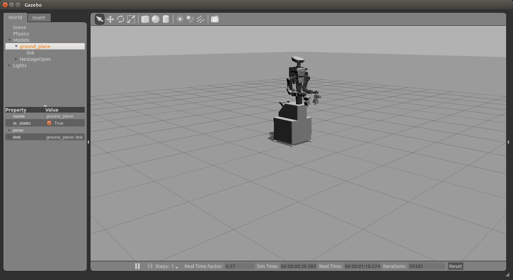
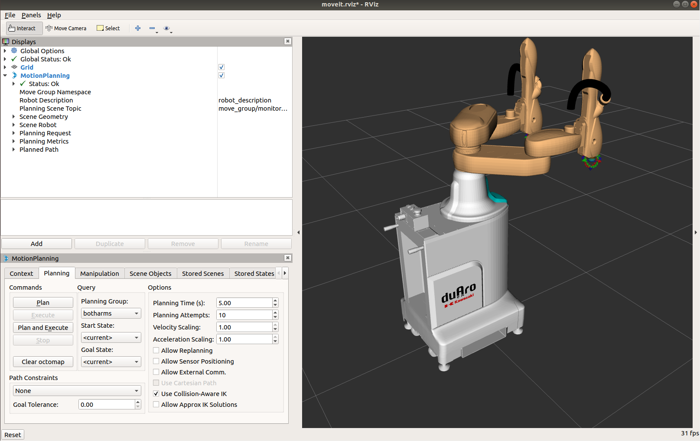
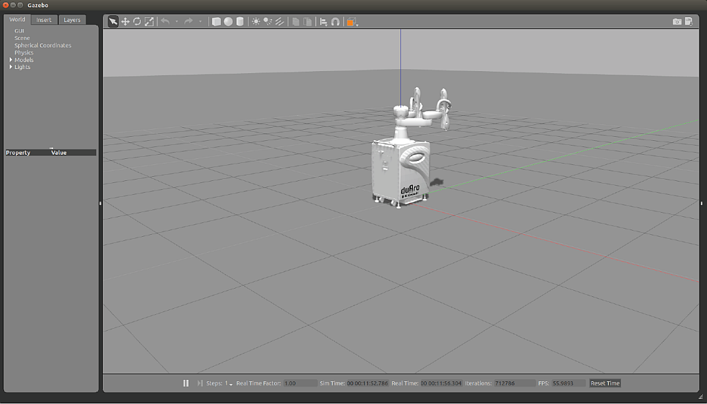
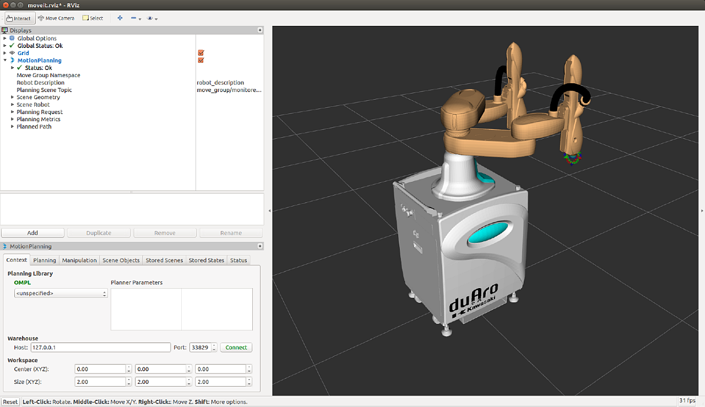
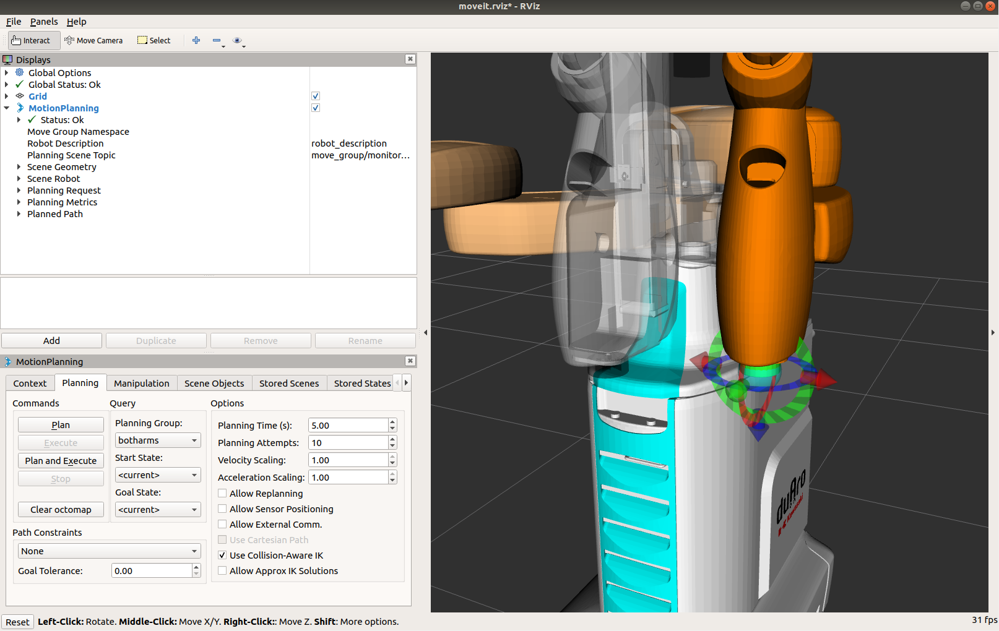

# NEDO ROSセットのシミュレータの利用

<!-- TOC -->

- [NEDO ROSセットのシミュレータの利用](#nedo-rosセットのシミュレータの利用)
    - [シミュレータの種類](#シミュレータの種類)
    - [ソフトウェアのインストール](#ソフトウェアのインストール)
            - [Gazebo シミュレータの起動](#gazebo-シミュレータの起動)
            - [MoveIt! の起動](#moveit-の起動)
            - [シミュレータの終了](#シミュレータの終了)
        - [KHI duaro - Gazebo シミュレータ](#khi-duaro---gazebo-シミュレータ)
            - [Gazebo シミュレータの起動](#gazebo-シミュレータの起動-1)
            - [MoveIt! の起動](#moveit-の起動-1)
            - [シミュレータの終了](#シミュレータの終了-1)
        - [MoveIt! GUI での動作計画](#moveit-gui-での動作計画)

<!-- /TOC -->

シミュレータ上のロボットを動かしてみます．  
本チュートリアルでは下記のロボットのシミュレータの利用方法を紹介します．

- NEXTAGE OPEN : 人型双腕ロボット
- KHI duAro : 双腕ロボット

## シミュレータの種類

本チュートリアルで扱うシミュレータには次のような種類があります．

- ROS のシミュレータ
  - NEXTAGE OPEN / Baxter Research Robot / MINAS TRA1 / KHI duaro
    - MoveIt! シミュレータ : 運動学のみの動作計画シミュレータ
    - Gazebo シミュレータ : 動力学を含む環境・物理シミュレータ
- hrpsys(RTM) シミュレータ
  - NEXTAGE OPEN のみ
    - 動力学を含む物理シミュレータ

本チュートリアルではどのシミュレータを使っても最終的には
動作計画ソフトウェアの MoveIt! を起動してその動作計画機能を利用します．

また，本チュートリアルの構成として，
NEXTAGE OPEN の Gazebo シミュレータと MoveIt! の組み合わせを基本として
各ロボットへの応用を展開する形を採っています．


## ソフトウェアのインストール

NEDO ROSセットでは，必要なソフトウェアはすでにインストールされています．
具体的なインストールの仕方は，Torkの
[MoveIt! Tutorial](https://github.com/tork-a/tork_moveit_tutorial/releases/tag/0.0.10)
を参照してください．

<!--
#### Gazebo シミュレータの起動

1つ目のターミナルで次のコマンドを入力しして
NEXTAGE OPEN Gazebo シミュレータを起動します．

**ターミナル-1** : Gazebo シミュレータの起動
```
$ roslaunch nextage_gazebo nextage_world.launch
:
:
[go_initial-6] process has finished cleanly
log file: /home/robotuser/.ros/log/5d4ac8aa-baeb-11e7-af06-001c4284b313/go_initial-6*.log
:
```

Gazebo が起動して上記のターミナルの出力が得られたら Gazebo シミュレータ内の
NEXTAGE OPEN ロボットの準備が完了しています．

<div align="center">

</div>
<div style="text-align: center;">NEXTAGE - Gazebo 起動画面</div>

#### MoveIt! の起動

もう一つ端末を起動して，次のコマンドを入力して MoveIt! を起動します．

**ターミナル-2** : MoveIt! の起動
```
$ roslaunch nextage_moveit_config demo.launch
$ roslaunch nextage_moveit_config moveit_planning_execution.launch
```

<div align="center">

</div>
<div style="text-align: center;">NEXTAGE - MoveIt! 起動画面</div>

これで MoveIt! の動作計画機能が利用できる状態になっています．

ここで，roslaunch について，確認しておきます．roslaunchコマンドは，

```
$ roslaunch <パッケージ名> <launchファイル名>
```

となっており，上では，

- パッケージ: nextage_moveit_config
- launchファイル: moveit_planning_execution.launch

が指定されています．これらの場所は，以下の通りです．

```
$ rospack find nextage_moveit_config
/opt/ros/melodic/share/nextage_moveit_config
```
rospack は ROS のパッケージ関連の操作や情報を表示するコマンドです．
つまり，このパッケージは /opt/ros/melodic/share/nextage_moveit_config に存在するということになります．

次に，rosls コマンドでこのパッケージの中身を見てみます．

```
$ rosls nextage_moveit_config
cmake  config  launch  package.xml   test
$ rosls nextage_moveit_config/launch/moveit_planning*
/opt/ros/melodic/share/nextage_moveit_config/moveit_planning_execution.launch
```

このように，指定されたパッケージの中のファイルを見ることができます．
この例では，moveit_planning_execution.launch ファイルが，/opt/ros/melodic/share/nextage_moveit_config/ の中にあることが確認できました．

#### シミュレータの終了

シミュレータを終了するには各ターミナルで Ctrl-C を入力してください．

-->

### KHI duaro - Gazebo シミュレータ

#### Gazebo シミュレータの起動

ターミナルを2つ開きます．

**ターミナル-1** : KHI duaro Gazebo シミュレータの起動
```
$ source /opt/ros/melodic/setup.bash
$ roslaunch khi_duaro_gazebo duaro_world.launch  
```

<div align="center">

</div>
<div style="text-align: center;">duAro - MoveIt! 起動画面</div>

しばらくすると次のようなメッセージが **ターミナル-1** に表示されます．

```
[INFO] [1557303124.764122, 0.426000]: Started controllers: joint_state_controller, duaro_lower_arm_controller, duaro_upper_arm_controller
[go_initial-8] process has finished cleanly
log file: /home/robotuser/.ros/log/f5391a42-7168-11e9-931c-1c1bb5f26084/go_initial-8*.log
```

これで Gazebo シミュレータの準備は終了です．


#### MoveIt! の起動

2つ目のターミナルで次のコマンドを実行して MoveIt! を起動します．

**ターミナル-2** : MoveIt! の起動
```
$ source /opt/ros/melodic/setup.bash
$ roslaunch khi_duaro_moveit_config demo.launch
または
$ roslaunch khi_duaro_moveit_config moveit_planning_execution.launch
```
<div align="center">

</div>
<div style="text-align: center;">duAro - MoveIt! 起動画面</div>

これで MoveIt! の動作計画機能が利用できる状態になっています．


#### シミュレータの終了

シミュレータでの作業が終わりましたら
全てのターミナルで Ctrl-C を入力することでシミュレータを終了します．

<$endif>


### MoveIt! GUI での動作計画

MoveIt! の動作計画機能を GUI から利用してみます．

MoveIt! / RViz (GUI) 上に表示されているロボットのエンドエフェクタのところに
水色の球や赤緑青(RGB)の矢印マークが表示されています．
これは InteractiveMarker と呼ばれるもので
MoveIt! の GUI でのマニピュレータ操作を行うためのものです．

> - エンドエフェクタ: End Effector (EEF)
>   - マニピュレータ先端に着けるハンド・グリッパ・工具などの機器

InteractiveMarker の球や矢印をマウスなどでドラッグ操作を行うと
オレンジ色のマニピュレータがそのドラッグ操作に追従して動きます．
これが目標姿勢となります．
そこで MotionPlanning 子ウィンドウ内の Planning タブ内の
` Plan and Execute` ボタンをクリックするとその目標姿勢に向かって
MoveIt! が動作計画を行い，シミュレータのロボットが動作します．

動作計画だけを行いたい場合は `Plan` ボタンをクリックします．

<div align="center">

</div>
<div style="text-align: center;">duAro - MoveIt! Plan/Execute</div>

このように MoveIt! の GUI 上で
InteractiveMarker を動かして目標値を設定し，動作計画を行い実行する
という操作は基本的にどのロボットでも共通です．


<!-- EOF -->
